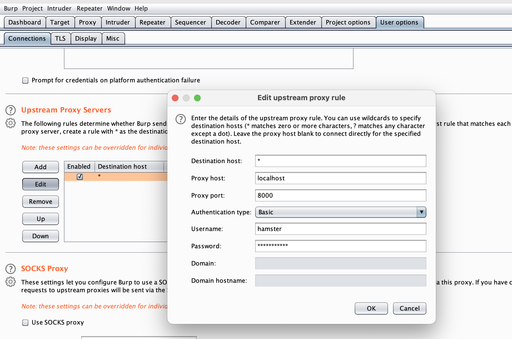
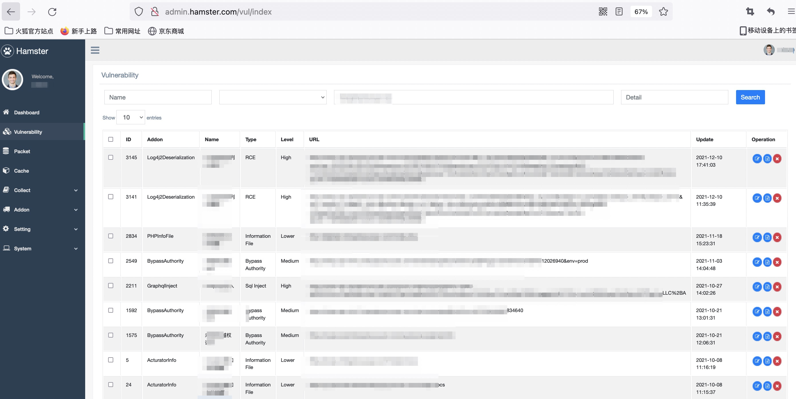

# 概述

Hamster是基于mitmproxy开发的异步被动扫描框架，基于http代理进行被动扫描，主要功能为重写数据包、签名、漏洞扫描、敏感参数收集等功能（开发中）。

[](https://www.python.org/)
[](https://www.mysql.com/)
[](https://www.rabbitmq.com/)
[](https://redis.io/)

# 模块

1. 漏洞扫描：`brower/burpsuite → server → rabbitmq ->agent → support → target `
2. 渗透测试辅助：`brower/burpsuite → server → target`

## server: 
1. 被动扫描代理端口
2. 管理控制台
3. 推送流量到agent进行扫描
4. 手工测试时进行签名、waf绕过。

## agent
1. 漏扫
2. 扫描的poc发送到supprt进行签名、waf绕过等

## supprt
1. 给agent进行签名、waf绕过等。

# 安装

```
# 通过dockerfile文件部署 mysql,redis,rabbitmq 
docker-compose up -d

# PIP安装依赖
python3.9 -m venv venv
source venv/bin/activate
pip install -r requirements.txt

# 如没有conf文件夹，则需要先生成配置文件，先运行一次init.py，生成相关配置文件（默认是dev环境）
python init.py

# 通过修改 conf/dev/*.conf 配置mysql,redis,rabbitmq,dnslog等
vim conf/dev/*.conf 

# 再一次运行，初始化数据库。
python init.py
```

# 配置

为了覆盖延迟型的SSRF、Log4j2等漏洞，对于此类数据包进行了缓存，因此此类漏洞的扫描也需要配合[DNSLog](https://github.com/orleven/Celestion) 。

1. 建议先配置[DNSLog](https://github.com/orleven/Celestion) ，并从[DNSLog](https://github.com/orleven/Celestion) 项目中获取到API-Key等信息。
2. 通过修改 `conf/dev/hamster_basic.conf` (第一次运行后生成) 配置mysql,redis,rabbitmq,dnslog，具体请看注释。 

# 运行

1. 运行server

```
source venv/bin/activate
python server.py
```

2. 运行agent

```
source venv/bin/activate
python agent.py
```

3. 运行support

```
source venv/bin/activate
python support.py
```

4. 设置浏览器HTTP代理或者设置burpsuite二级代理`upstream proxy servers`, 代理认证请配置 `conf/hamster.conf`.



* host: localhost
* port: 8000
* authtype: basic
* username: hamster
* password: Hamster@123 

5. 然后浏览器访问目标网站就可以进行漏洞扫描了。

6. 也可以查看访问控制台`http://admin.hamster.com/hamster/`查看扫描结果



* url: http://admin.hamster.com/hamster/
* username: admin
* password: hamster@123 

# 插件编写

插件目录为`addon`，具体功能如下(addon本后续不再更新)：

1. `addon/agent` agnet用, 主要存放扫描poc。
2. `addon/common` server、support共用，可用于给数据包waf、sign等。
3. `addon/server` server用，一般涉及数据包加解密时和supprt联用。
4. `addon/support` support用，一般涉及数据包加解密时和server联用。

同目录下addon按照字母顺序加载，如果脚本之间存在运行先后逻辑，请合理安排脚本文件名。

PS: 参考插件模版目录`test_addon`即可。

# 关于缓存日志查询

日志保存天数，默认3天，数据库缓存默认1天。
1. 如果dnslog告警了，请等待2分钟后，在漏洞中查看。
2. 如果短时间内触发多个dnslog，且漏洞仅更新了1个的话，这是因为这几个dnslog的触发原因是一样的，漏洞已做了去重处理，忽略就行。
3. 如果dnslog告警，且漏洞没有更新，表示这个漏洞是延迟触发的，且超过了数据库缓存天数，可以尝试在logs目录中查找，如果还是没找到，那就是说明延迟太久了，缓存已经没了。

```
find log/ -name "*" -print0 | xargs -0 grep -i -n "{dnslog}" 2>/dev/null
```

# mysql binlog文件过大问题

编辑 `my.cnf` 并在`[mysqld]`下添加`skip-log-bin`关闭binlog，并重启mysql即可。

```
set global binlog_expire_logs_seconds=10;
set persist binlog_expire_logs_seconds=10;
```

# xray poc 兼容

`poc/xray/pocs` 简单兼容了xray poc，目前这个模块写的比较糙，不建议放入全部poc。
